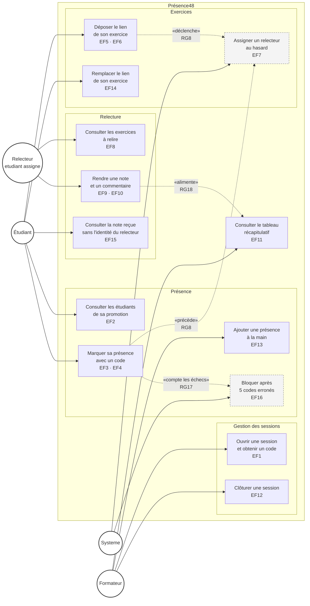

# D1 — Diagramme de cas d'utilisation

Acteurs de Présence48 et ce que chacun peut faire. Chaque cas d'utilisation porte la référence
de l'exigence fonctionnelle correspondante du cahier des charges.

## Ce que le diagramme dit, et pourquoi

**Le relecteur apparaît comme un acteur distinct mais ne l'est pas dans le modèle.** Il figure ici
séparément de l'étudiant parce qu'il exerce des cas d'utilisation différents, mais la section 2 du
cahier des charges tranche que c'est **un étudiant dans un état** — celui d'avoir été tiré au sort.
C'est pour cela que son étiquette porte la mention *étudiant assigné*, et c'est pour cela qu'aucune
table `Relecteur` n'existe en D2.

**Le « Système » est un acteur au sens UML.** Deux cas d'utilisation ne sont déclenchés par
personne : l'assignation au hasard d'un relecteur (RG8) et le blocage après cinq échecs (RG17).
Les rattacher au formateur ou à l'étudiant serait faux — aucun des deux ne les commande. Ils sont
tracés en pointillé pour cette raison.

**Les quatre relations en pointillé sont les dépendances métier**, pas des appels techniques :
déposer un exercice déclenche le tirage au sort, marquer sa présence élargit l'ensemble des
relecteurs éligibles, une saisie de code alimente le compteur d'échecs, et une note rendue alimente
la moyenne du tableau.

## Ce que chaque acteur ne peut pas faire

Les interdictions ne se dessinent pas dans un diagramme de cas d'utilisation — c'est une limite du
formalisme, pas un oubli. Elles sont dans la troisième colonne du tableau des acteurs, section 2 du
cahier des charges : le relecteur ne choisit pas l'exercice qu'il relit (RG8), il ne relit jamais le
sien (RG2), il ne revient pas sur une relecture validée (RG13), et l'étudiant ne connaît jamais
l'identité de son relecteur (RG14).
