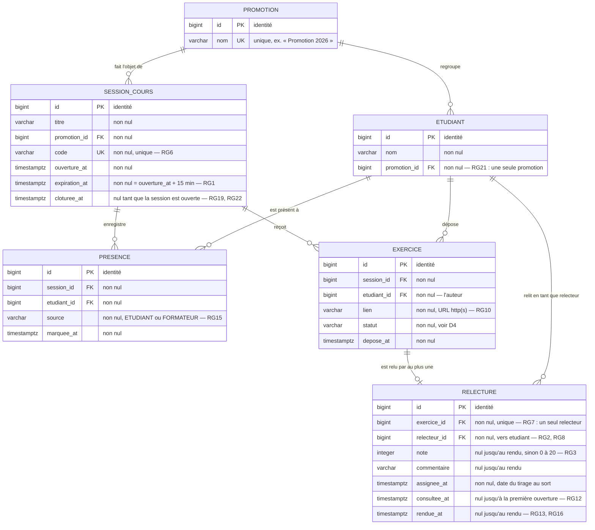

# D2 — Modèle de données

Ce diagramme est le **contrat interne** entre l'analyse et la base. Il doit correspondre exactement
à la migration Flyway `V1__schema_initial.sql` : toute divergence entre les deux est un défaut, pas
une approximation.

## Correspondance avec la migration `V1__schema_initial.sql`

Chaque règle de gestion est tenue soit par une contrainte de base, soit par le service — jamais par
les deux à moitié, et jamais nulle part.

| Règle | Tenue par | Traduction |
|---|---|---|
| **RG1** — le code expire 15 min après l'ouverture | Base + service | `expiration_at NOT NULL`, calculée à l'insertion ; le service compare à l'instant courant |
| **RG2** — pas d'auto-relecture | **Service seul** | Une contrainte `CHECK` ne peut pas comparer `relecture.relecteur_id` à `exercice.etudiant_id`, qui vit dans une autre table. Vérifié dans le service, couvert par le test unitaire de B6 |
| **RG3** — note entière de 0 à 20 | Base + DTO | `CHECK (note IS NULL OR note BETWEEN 0 AND 20)` et `@Min(0) @Max(20)` sur un `Integer` |
| **RG4** — une seule présence par étudiant et session | **Base** | `UNIQUE (session_id, etudiant_id)` sur `presence` |
| **RG6** — code unique | **Base** | `UNIQUE (code)` sur `session_cours` |
| **RG7** — un seul relecteur par exercice | **Base** | `UNIQUE (exercice_id)` sur `relecture` |
| **RG9** — un seul exercice par étudiant et session | **Base** | `UNIQUE (session_id, etudiant_id)` sur `exercice` |
| **RG10** — lien URL `http(s)` | DTO | Validation à l'entrée, `400 LIEN_INVALIDE` |
| **RG15** — source d'une présence | **Base** | `CHECK (source IN ('ETUDIANT','FORMATEUR'))` |
| **RG18** — moyenne nulle si aucune note | Requête | Agrégation `AVG(note)` sur les relectures rendues seulement : SQL renvoie `NULL` sur un ensemble vide, exactement ce que le contrat déclare `nullable` |
| **RG19** — plus rien après la clôture | Service | Test sur `cloturee_at IS NOT NULL` |
| **RG21** — un étudiant, une promotion | **Base** | `promotion_id NOT NULL` sur `etudiant`, pas de table de liaison |

## Choix de modélisation à expliquer

**La table s'appelle `session_cours`, pas `session`.** `SESSION` est un mot réservé du standard SQL ;
Postgres le tolère comme nom de table, H2 en mode compatibilité PostgreSQL pas toujours. Comme nos
tests rejouent les mêmes migrations sur H2 (section 8 du cahier des charges), nous évitons le piège
plutôt que d'échapper le nom partout.

**Aucune table `Relecteur`.** Le rôle est porté par `relecture.relecteur_id`, qui pointe vers
`etudiant`. C'est la traduction directe de la décision de la section 2 : le relecteur est un
étudiant dans un état. C'est aussi la seule modélisation qui permette d'exprimer RG2, qui compare
l'auteur et le relecteur comme deux références au même référentiel.

**Aucune table `Formateur`.** Le contrat d'API ne transmet jamais l'identité du formateur :
`POST /api/sessions` ne prend que `{ titre, promotionId }`. Créer une table que rien ne peut
alimenter serait un ornement. La seule trace du formateur dans les données est
`presence.source = 'FORMATEUR'`, exigée par Q14.

**Le statut d'une session n'est pas une colonne.** Une session est ouverte si `cloturee_at IS NULL`,
clôturée sinon. Stocker en plus un `statut` créerait deux sources de vérité qui peuvent diverger.
L'exercice, lui, porte bien un `statut` en colonne, parce que son cycle de vie a quatre états qui ne
se déduisent pas d'une seule date (voir D4).

**`relecture` est créée au dépôt de l'exercice, pas au rendu.** La ligne existe dès le tirage au
sort, avec `note`, `commentaire`, `consultee_at` et `rendue_at` à `NULL`. C'est ce qui permet de
compter les `relecturesEnAttente` du tableau (RG16) : une relecture en attente est une ligne qui
existe et dont `rendue_at` est nul.

**`consultee_at` existe pour départager Q13.** Le client dit qu'on peut remplacer son lien « tant que
personne n'a commencé à le relire ». Comme le relecteur est assigné dès le dépôt, l'assignation ne
peut pas être le moment où la relecture « commence » — sinon un remplacement n'aurait jamais été
possible et Q13 serait sans objet. Nous posons donc que la relecture commence quand le relecteur
ouvre l'exercice pour la première fois. Cette zone d'ombre est consignée en section 7 du cahier des
charges et affine RG12.

## Ce qui n'est délibérément pas dans le modèle

**Le compteur d'échecs de RG17** (blocage après cinq codes erronés) n'a aucune table ici. EF16 est
priorisée **Could** : elle ne sera peut-être pas livrée, et faire figurer en D2 une table qui
n'existerait pas dans les migrations casserait la cohérence que le barème vérifie précisément. Si
EF16 est livrée, elle ajoutera une table `tentative_code` **et** une révision de ce diagramme, notées
dans le journal des révisions du cahier des charges.
