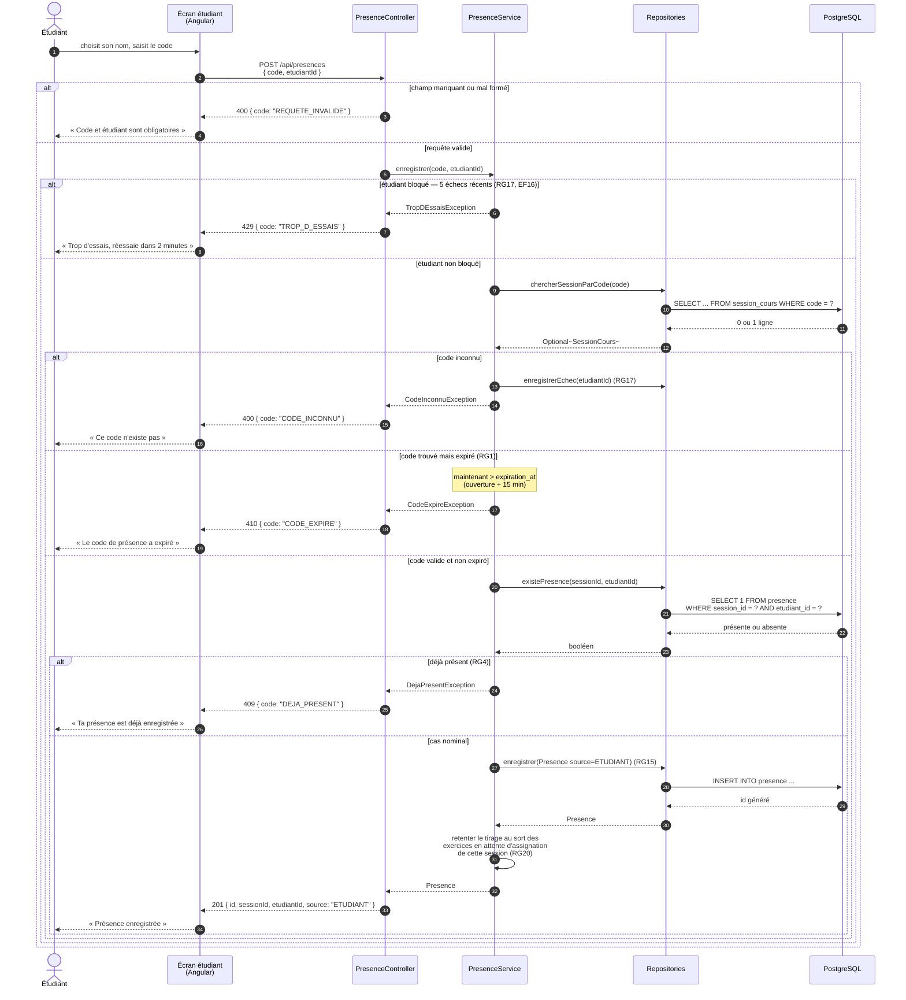

# D3 — Séquence : marquer sa présence

Cas nominal et **tous** les cas d'erreur de `POST /api/presences`. Les codes de statut et les codes
d'erreur de ce diagramme sont ceux de `api/contrat.yaml`, à la lettre : c'est la cohérence entre les
deux que le barème vérifie.

## Correspondance avec le contrat d'API

| Situation | Code HTTP | Code d'erreur | Règle | Au contrat |
|---|---:|---|---|---|
| Présence enregistrée | `201` | — | RG15 | Imposé |
| Champ absent ou mal formé | `400` | `REQUETE_INVALIDE` | — | Ajouté (B4) |
| Code inexistant | `400` | `CODE_INCONNU` | — | Imposé |
| Code de plus de 15 minutes | `410` | `CODE_EXPIRE` | RG1 | Imposé |
| Étudiant déjà présent à cette session | `409` | `DEJA_PRESENT` | RG4 | Imposé |
| Cinq codes erronés consécutifs | `429` | `TROP_D_ESSAIS` | RG17 | Ajouté (Q4) |

## L'ordre des vérifications est un choix, pas un hasard

Les contrôles s'enchaînent dans cet ordre précis : **validation → blocage → code inconnu →
expiration → doublon**. Trois raisons.

**Le blocage passe avant la recherche du code.** RG17 existe pour empêcher de deviner les codes par
essais successifs (« sinon ils vont deviner les codes entre eux », Q4). Si l'on cherchait le code
avant de vérifier le blocage, un étudiant bloqué apprendrait quand même si son code existe — et la
règle ne servirait plus à rien.

**« Inconnu » passe avant « expiré ».** On ne peut pas dire qu'un code est expiré tant qu'on ne l'a
pas trouvé. C'est aussi ce qui explique l'apparente étrangeté du contrat, qui répond `400` pour un
code inconnu et `410` pour un code expiré : `410 Gone` signifie « cette ressource a existé et
n'existe plus », ce qui n'a de sens que pour un code réellement émis.

**« Déjà présent » passe en dernier.** Répondre `409` sur un code expiré renseignerait l'étudiant sur
la validité passée du code sans qu'il ait eu besoin d'un code valide. L'expiration est une propriété
du code, le doublon une propriété de la relation entre l'étudiant et la session : on vérifie le code
d'abord, la relation ensuite.

## Un effet de bord assumé

Le cas nominal se termine par une action qui n'a rien à voir avec la présence : **retenter le tirage
au sort des exercices en attente d'assignation** (RG20). C'est la conséquence directe de la zone
d'ombre tranchée en section 7 — quand un exercice a été déposé alors qu'aucun autre étudiant n'était
présent, l'arrivée d'un nouveau présent rend le tirage possible. Le faire ici est le seul moyen de
ne pas laisser un exercice orphelin, et cela ne peut pas échouer du point de vue de l'étudiant qui
marque sa présence : si le tirage échoue encore, l'exercice reste simplement en attente.
