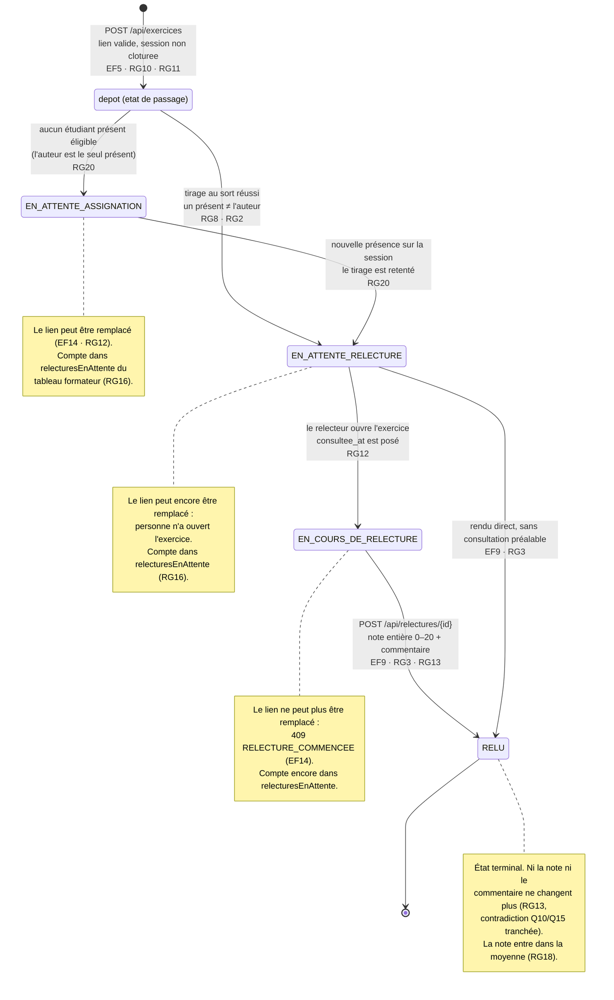

# D4 — États et transitions : cycle de vie d'un exercice

*Quatrième diagramme, facultatif au sujet (bonus +3 points).*

La colonne `exercice.statut` de D2 ne prend que les quatre valeurs de ce diagramme. `DEPOSE`
n'y figure pas : c'est un état de passage, jamais écrit en base.

## Ce que le diagramme rend visible

**`RELU` est terminal, et c'est la contradiction Q10/Q15 rendue graphique.** Aucune flèche ne sort de
`RELU` vers un état antérieur. Si nous avions tranché en faveur de Q10, il y aurait ici une
transition `RELU → EN_COURS` conditionnée par « la session n'est pas clôturée » — et l'API devrait
accepter un second `POST /api/relectures/{id}` au lieu de renvoyer le `409 RELECTURE_DEJA_RENDUE` que
le contrat impose. Le diagramme et le contrat disent donc la même chose, ce qui est précisément
l'objet du contrôle de cohérence.

**La clôture de session n'est pas un état de l'exercice.** On pourrait croire qu'un exercice devrait
passer à un état « clôturé » quand le formateur clôture la session. Ce serait une erreur de
modélisation : la clôture est un état de la **session**, et elle interdit certaines transitions
(plus de dépôt, plus de rendu — RG19) sans changer l'état des exercices existants. Un exercice resté
en `EN_ATTENTE_RELECTURE` dans une session clôturée n'a pas été relu, et le tableau du formateur doit
continuer à le dire (RG16). Représenter la clôture ici aurait effacé cette information.

**`EN_ATTENTE_ASSIGNATION` n'est pas un état d'erreur.** L'étudiant reçoit un `201` dans tous les cas :
il a bien déposé son exercice, et le fait qu'aucun relecteur n'ait pu être tiré au sort ne lui est pas
imputable et ne le concerne pas. C'est un état d'attente du système, visible du formateur seul.

**Il y a deux chemins vers `RELU`.** Un relecteur consciencieux ouvre l'exercice puis rend sa note, et
passe par `EN_COURS`. Mais rien n'oblige à consulter avant de rendre : la transition directe
`EN_ATTENTE_RELECTURE → RELU` existe pour que le modèle ne mente pas sur ce qui est techniquement
possible. Les deux chemins aboutissent au même état terminal.

## Les trois états que l'on compte dans le tableau

`relecturesEnAttente`, dans `GET /api/tableau`, dénombre pour chaque étudiant les relectures **qu'il
doit rendre** — donc les exercices d'autrui qui lui sont assignés et se trouvent dans l'un des états
`EN_ATTENTE_ASSIGNATION` (non, par définition : aucun relecteur n'est encore assigné),
`EN_ATTENTE_RELECTURE` ou `EN_COURS_DE_RELECTURE`. Autrement dit : les lignes de `relecture` dont il
est le relecteur et dont `rendue_at` est nul. C'est exactement ce que dit Q16 — « les relectures
qu'il doit encore faire » — et ce que RG16 formalise.
